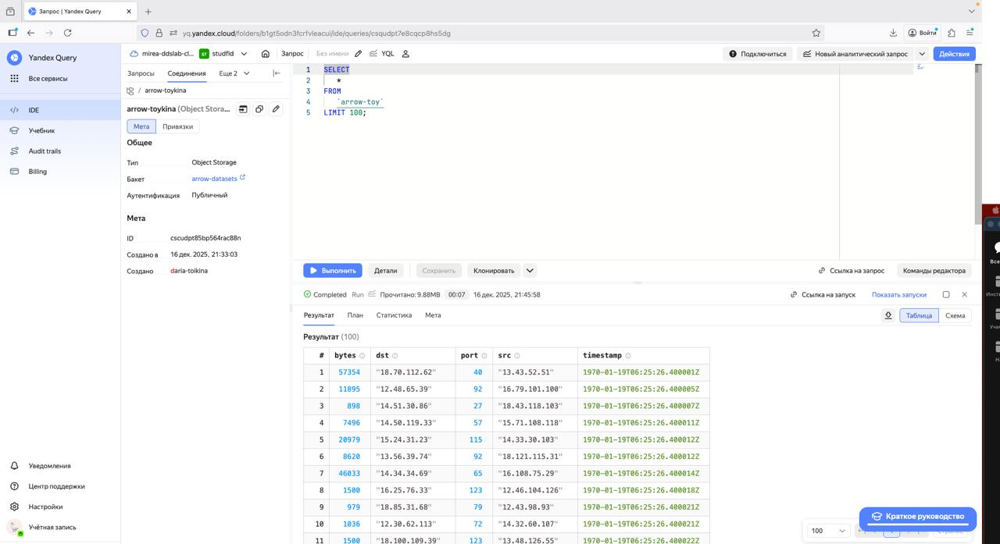
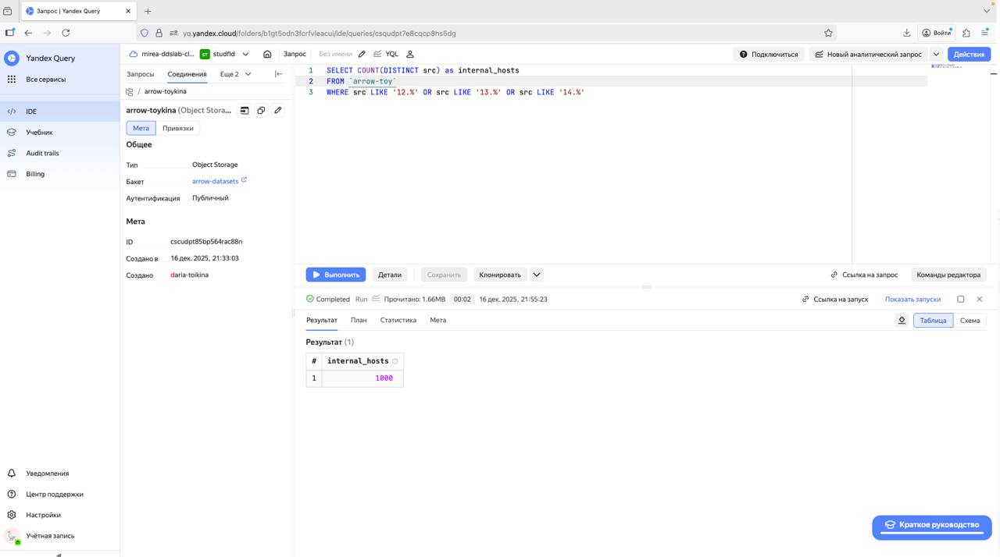
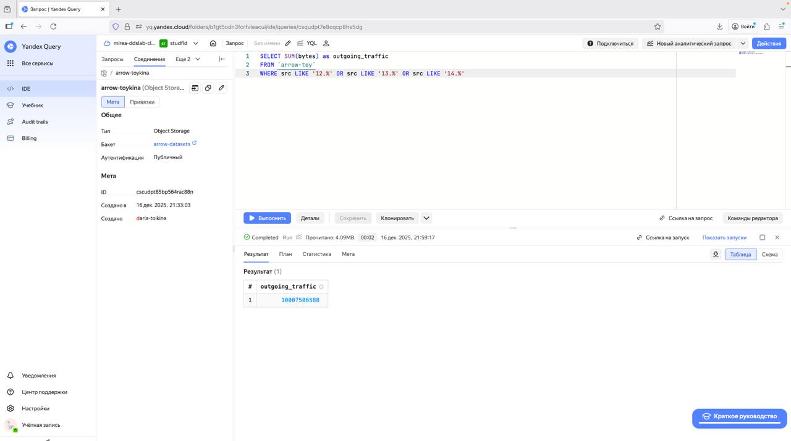
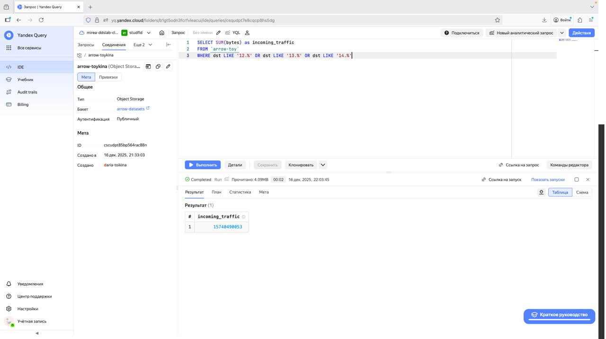

# Lab7
daria.toikina@yandex.ru
2025-12-11

# Цель работы

1\. Изучить возможности технологии Yandex Query для анализа
структурированных наборов данных

2\. Получить навыки построения аналитического пайплайна для анализа
данных с помощью сервисов Yandex Cloud

3\. Закрепить практические навыки использования SQL для анализа данных
сетевой активности в сегментированной корпоративной сети

# Исходные данные

1\. Ноутбук с ОС MacOS

2\. RStudio

3\. Интерпретатор языка R 4.5.1

# Ход работы

## Шаг 1. Проверить доступность данных в Yandex Object Storage

Перешёла по ссылке на файл в S3-хранилище, убедился, что файл
yagry_dataset.pqt доступен для чтения.

## Шаг 2. Подключить бакет как источник данных для Yandex Query

### 1. Создать соединение для бакета в S3 хранилище

### 2. Создание привязки данных

### 3. Проверила корректность привязки простым запросом

## Шаг 3. Анализ

### Известно, что IP адреса внутренней сети начинаются с октетов, принадлежащих интервалу \[12-14\]. Определите количество хостов внутренней сети,представленных в датасете.

### Определите суммарный объем исходящего трафика

### Определите суммарный объем входящего трафика

# Оценка результатов

В ходе практической работы успешно изучены и применены возможности
Yandex Query для анализа структурированных данных сетевой активности.
Освоена настройка подключения к данным в Yandex Object Storage, создана
привязка к файлу в формате Parquet и выполнены аналитические SQL-запросы
для оценки состояния корпоративной сети. Все запросы выполнены
корректно, получены количественные показатели, характеризующие сетевой
трафик.

# Вывод

Работа подтвердила эффективность использования облачного сервиса Yandex
Query для задач анализа сетевой безопасности. В результате анализа
определены ключевые метрики внутренней сети: количество активных хостов,
а также объемы входящего и исходящего трафика. Полученные навыки
позволяют применять облачные технологии и язык SQL для мониторинга
сетевой активности и оперативного выявления аномалий.
