# Цель работы

1\. Изучить возможности технологии Yandex DataLens для визуального анализа структурированных наборов данных

2\. Получить навыки визуализации данных для последующего анализа с помощью сервисов Yandex Cloud

3\. Получить навыки создания решений мониторинга/SIEM на базе облачных продуктов и открытых программных решений

4\. Закрепить практические навыки использования SQL для анализа данных сетевой активности в сегментированной корпоративной сети

# Исходные данные

1\. Ноутбук с ОС MacOS

2\. RStudio

3\. Интерпретатор языка R 4.5.1

# Ход работы

## Шаг 1. Настроить подключение к Yandex Query из DataLens

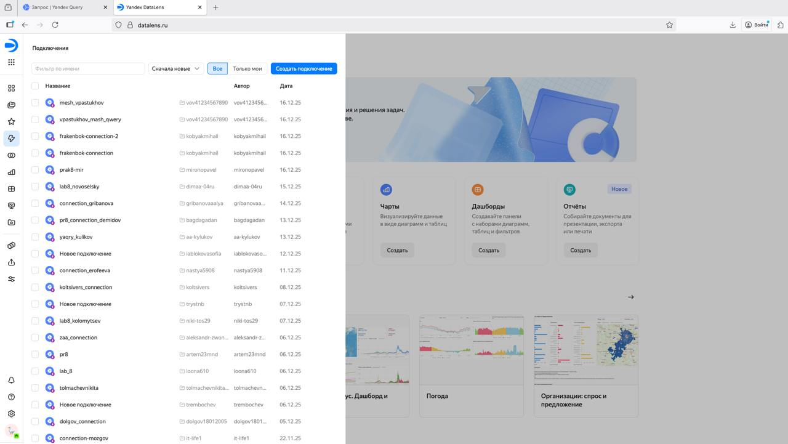

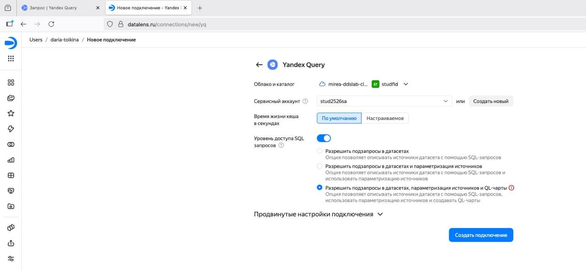

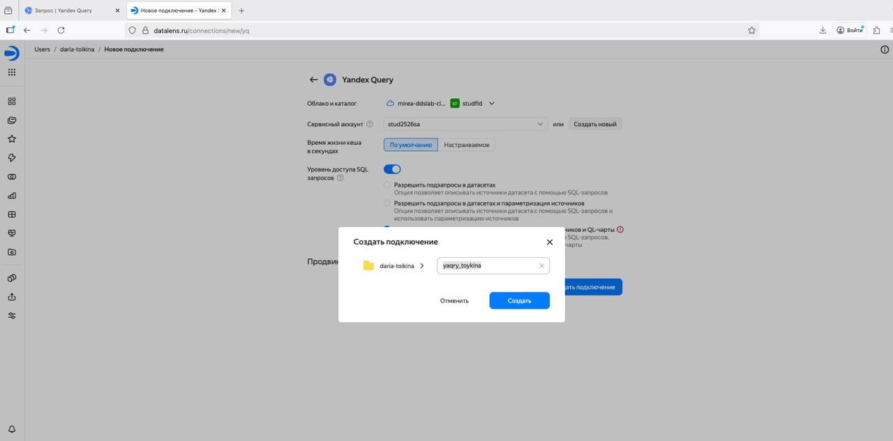

## Шаг 2. Создать из запроса YandexQuery датасет DataLens

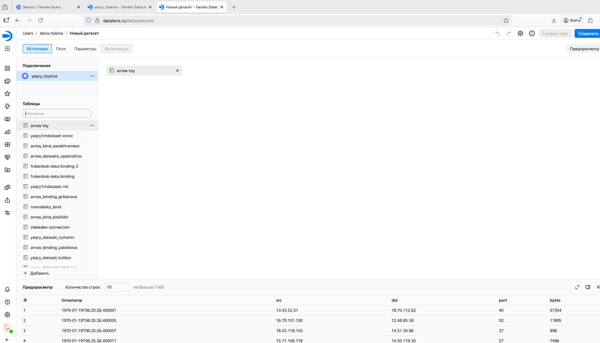

## Шаг 3. Делаем нужные графики и диаграммы

### Создание столбчатой диаграммы

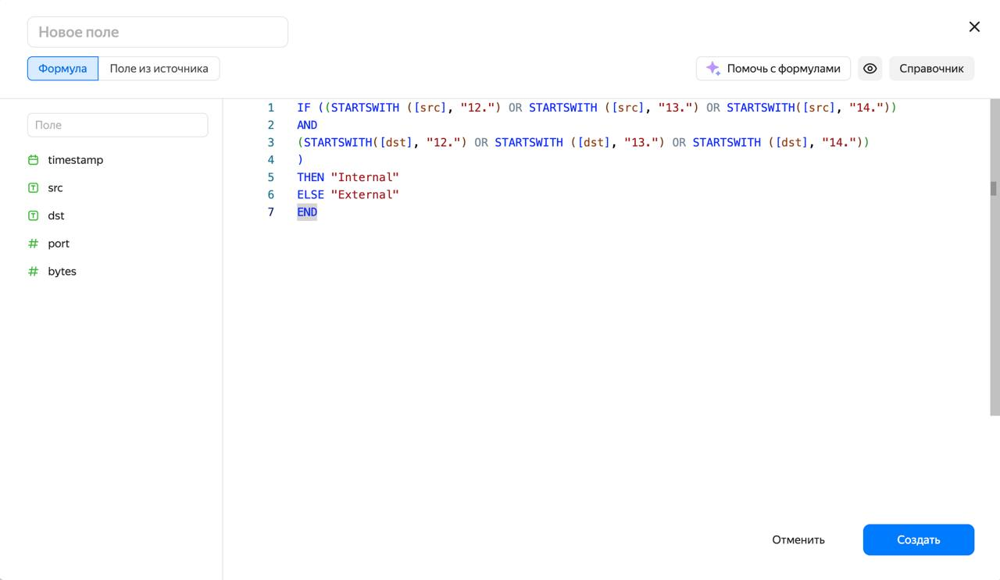

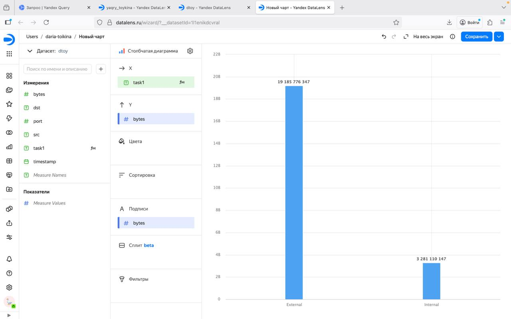

### Создание круговой диаграммы

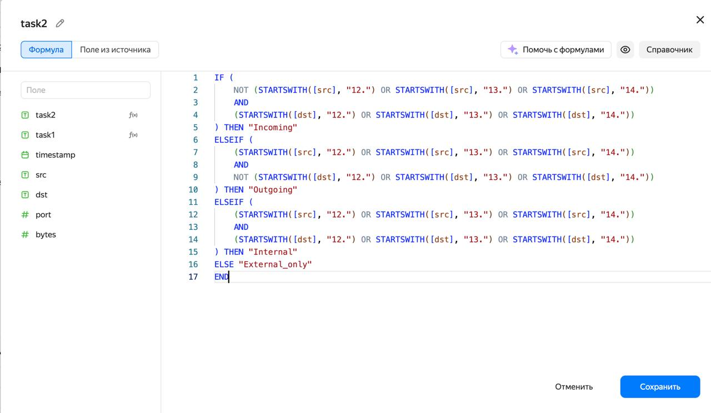

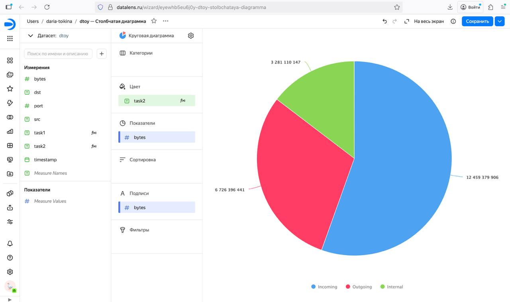

### Создание линейной диаграммы

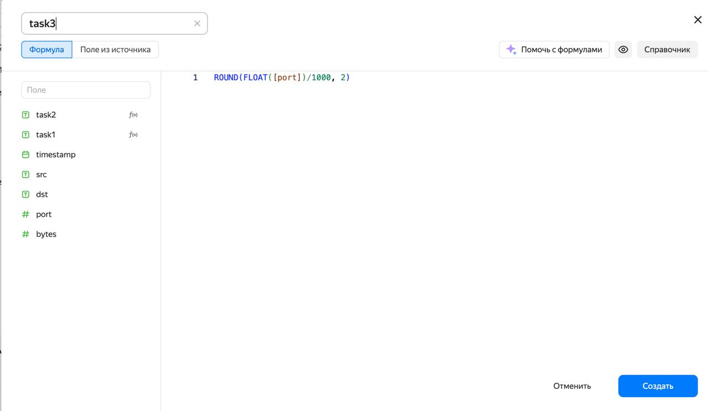

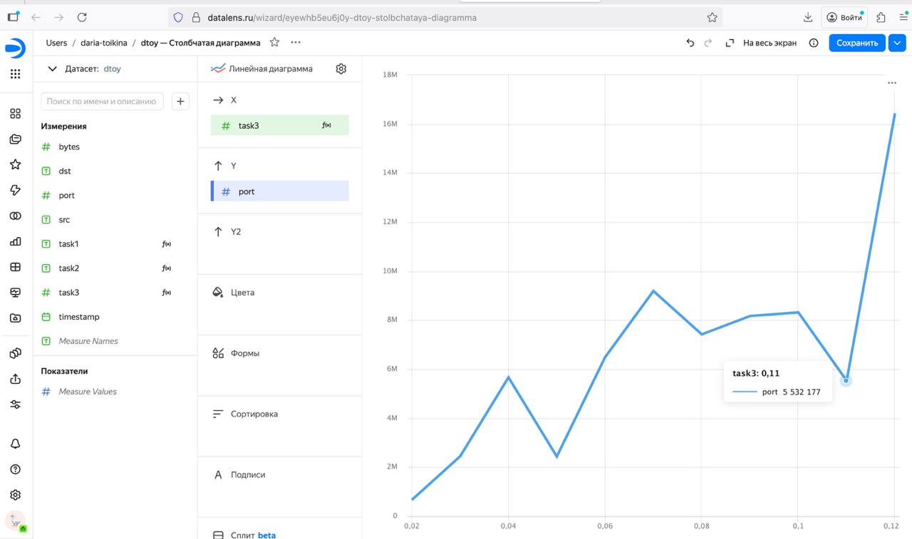

## Шаг 4. Составляем дашборд

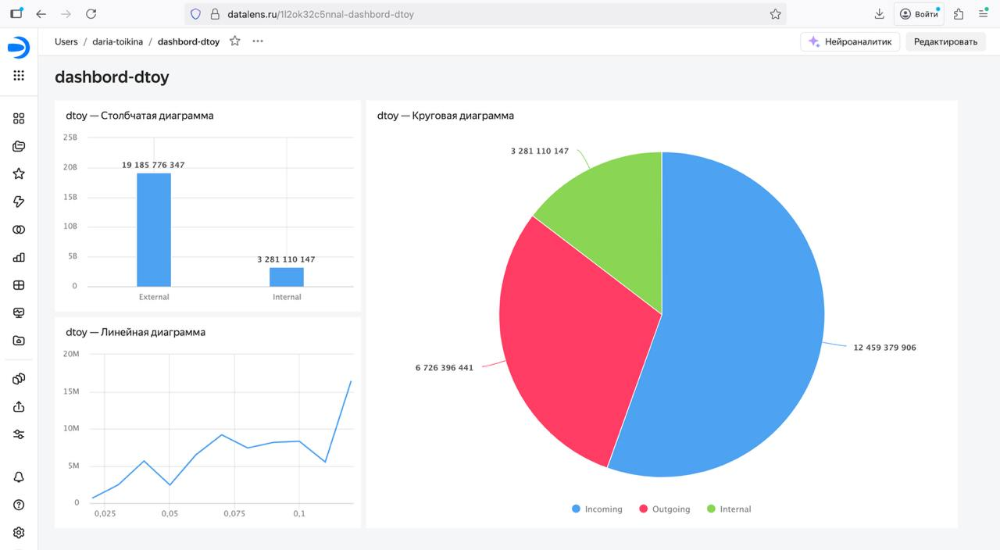

Ссылка на дашборд - https://datalens.ru/1l2ok32c5nnal-dashbord-dtoy

# Оценка результата

В рамках практической работы был успешно настроен сервис Yandex DataLens, созданы три специализированных датасета и построены визуализации для комплексного анализа сетевого трафика. Инструментарий продемонстрировал высокую эффективность для оперативного мониторинга и наглядного представления данных.

# Вывод

В ходе выполнения работы освоены ключевые возможности Yandex DataLens для визуализации сетевой активности корпоративной среды. Разработанные дашборды обеспечивают интуитивно понятный мониторинг трафика в реальном времени, а применение SQL для классификации сетевых потоков подтвердило практическую значимость облачных решений в задачах информационной безопасности.
